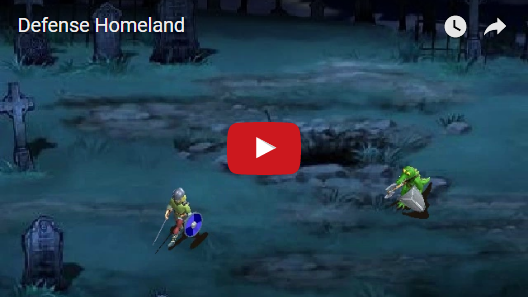
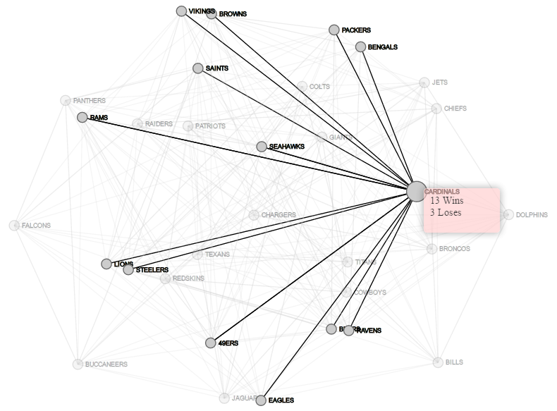
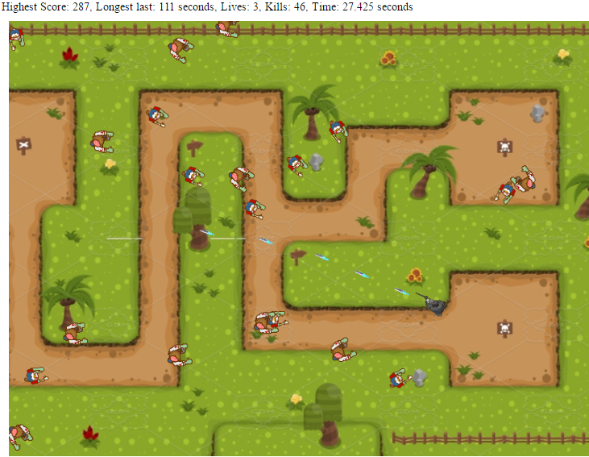
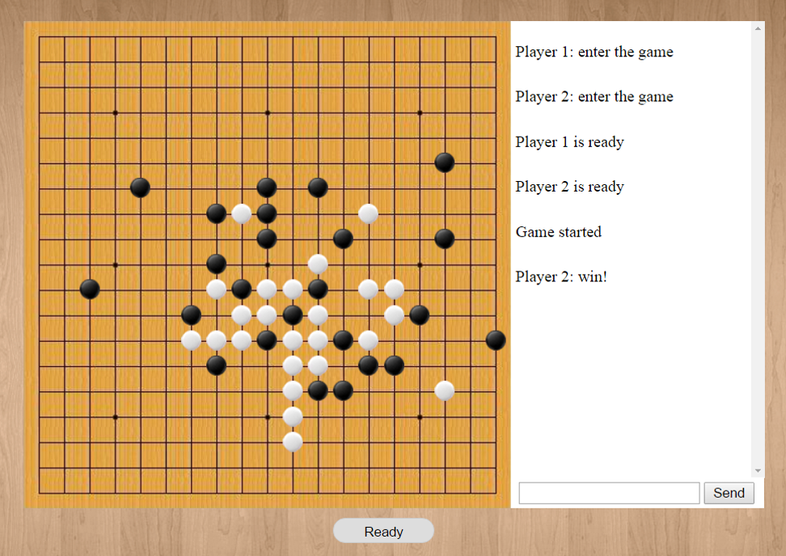

# Portfolio
I'm available for hire as a software engineer. I can be reached out at cao104@purdue.edu

 
## Java
* [Online Marketplace (Ongoing)](https://github.com/caozh/Portfolio/tree/master/Java/Online_Marketplace)  
An online B2C shopping platform, applying **Object-Orient Software Design** and **Software Design Patterns** and frameworks for **Distributed Computing**.	
	* [Design](https://github.com/caozh/Portfolio/blob/master/Java/Online_Marketplace/Diagrams/Authorization_pattern_UML.PNG)
* [Wireless Sensor Network Code Disseminator](https://github.com/caozh/Portfolio/tree/master/Java/UI_and_DB_design)  
<a href="https://github.com/caozh/Portfolio/tree/master/Java/UI_and_DB_design"></img></a> 
A front-end for a code disseminator (PhD. students’ research project) working in a wireless sensor network. 
It allows the sensors information and statuses be maintained efficiently by cooperating the **user-friendly front-end** and **dedicated database**.
	* [Presentation](https://github.com/caozh/Portfolio/blob/master/Java/UI_and_DB_design/Demo.pdf)
* [Edge and Line Detection](https://github.com/caozh/Portfolio/tree/master/Java/Edge_and_line_detection)  
<a href="https://github.com/caozh/Portfolio/tree/master/Java/Edge_and_line_detection"></img></a> 
Applying two mechanisms (**Canny Edge Detector** & **Hough Transform**) to detect low level image features (edges) and detect larger structures formed by these low level features (lines).
	* [Report](https://github.com/caozh/Portfolio/blob/master/Java/Edge_and_line_detection/Report.pdf)
* [Image Manipulation](https://github.com/caozh/Portfolio/tree/master/Java/Image_manipulation)  
<a href="https://github.com/caozh/Portfolio/tree/master/Java/Image_manipulation"></img></a> 
Implementing some **Image Point Transformations** and **Spatial Filtering Operations**: 
(Histogram Equialization, Logarithm mapping, Rotation, Gaussian filtering, and Median filtering)
	* [Report](https://github.com/caozh/Portfolio/blob/master/Java/Image_manipulation/Report.pdf)
* [Cryptography Studies](https://github.com/caozh/Portfolio/tree/master/Java/Cryptography_studies)

## C++
* [Augmented Reality](https://github.com/caozh/Portfolio/tree/master/Cpp/Augmented_Reality)  
<a href="https://youtu.be/nkjL9Scrxo8" target="_blank"></img></a> 
This project utilized the **OpenCV** library to display the combining view of **computer-generated input** (xyz axis bars) overlaying the **reality view from camera**. 
It is done by **recognizing predefined markers** and **tracking them in real-time**, meanwhile attaching xyz axis bars to show the directions. (With OpenGL lib, More complex 3D model can be used)
	* [Presentation](https://github.com/caozh/Portfolio/blob/master/Cpp/Augmented_Reality/Presentation_Augmented_Reality.pdf)
* [Edge Detection](https://github.com/caozh/Portfolio/tree/master/Cpp/Edge_detection)  
<a href="http://cs.iupui.edu/~caozh/CSCI_43500/edge_detection/edge_dection.html"></img></a> 
This project loads a raw image into 2D array, applys differentiation filters on X and Y directions to retrieve image primitive edges, at last, combines them to get the recognizable edges.
* [Image Filtering](https://github.com/caozh/Portfolio/tree/master/Cpp/Image_filtering)  
<a href="http://cs.iupui.edu/~caozh/CSCI_43500/filter/filter.html"></img></a> 
This project is designed to apply Average/Motion/Gaussian filters on an input raw image.
* [Algorithm Studies](https://github.com/caozh/Portfolio/tree/master/Cpp/Algorithm_studies)
	* [Algorithms Running Time Analysis](https://github.com/caozh/Portfolio/tree/master/Cpp/Algorithm_studies/Algorithms_running_time_analysis)
	* [ColumnSort vs QuickSort](https://github.com/caozh/Portfolio/tree/master/Cpp/Algorithm_studies/ColumnSort_VS_QuickSort)
	* [Huffman Encoding](https://github.com/caozh/Portfolio/tree/master/Cpp/Algorithm_studies/Huffman_encoding)
	* [Knights Tour](https://github.com/caozh/Portfolio/tree/master/Cpp/Algorithm_studies/Knights_tour)
	* [Find Peak](https://github.com/caozh/Portfolio/tree/master/Cpp/Algorithm_studies/Find_peak)

## PHP
* [Online Shopping System](https://github.com/caozh/Portfolio/tree/master/PHP/Online_shopping_system)  
<a href="http://cs.iupui.edu/~caozh/CSCI_45200/project/Fangbing/"></img></a> 
The online shopping system is a secure and reliable online platform for customer to customer (C2C) business. 
The system performs respective functionalities for **Administrator, Seller, and Customer** users. Product quantity management is implemented. 

## Database
* [In-Flight Entertainment System](https://github.com/caozh/Portfolio/tree/master/Database/In-Flight_Entertainment_System)  
<a href="https://github.com/caozh/Portfolio/tree/master/Database/In-Flight_Entertainment_System"></img></a> 
IFES offers enjoyable entertainment during the airline flight. There are many records are needed to be stored and operated in order to keep the system running. 
It is a **BCNF database system** under **Microsoft SQL Server (SSMS)**. 
SQL functions are predefined to **serve multiple use-cases** of the Entertainment System. 
* [Apartment DB System](https://github.com/caozh/Portfolio/tree/master/Database/Apartment_DB_System)  
<a href="https://github.com/caozh/Portfolio/tree/master/Database/Apartment_DB_System"></img></a> 
A database system for apartment management. It is designed in 3NF manner and working with a java front-end.
## Python
* [Defense Homeland](https://github.com/caozh/Portfolio/tree/master/Python/Defense_Homeland)  
<a href="https://youtu.be/3QDIKhWIZGg" target="_blank"></img></a> 
A funny ACT combat game against an AI Croco-monster. It is written in python with pygame library. 
	* [Documentation](https://github.com/caozh/Portfolio/blob/master/Python/Defense_Homeland/Documentation.pdf)
* [Transport Layer Protocol](https://github.com/caozh/Portfolio/tree/master/Python/Transport_Layer_Protocol)  
<a href="https://github.com/caozh/Portfolio/tree/master/Python/Transport_Layer_Protocol"></img></a> 
It is a reliable UDP protocol using a **Sliding Window model** (**Go-Back-N** mechanism) to transit packets reliably.

# C
* [Compiler](https://github.com/caozh/Portfolio/tree/master/C/Compiler)  
A compiler written in C with **Lex** and **Yacc** tools. This compiler is developed to translate CLIP (C like) language into target machine code. 
The compiler contains five phases: **Lexical analysis, syntax analysis, semantic analysis, Intermediate code generation,** and **code generation**.

## Web Technologies
* [D3](https://github.com/caozh/Portfolio/tree/master/Web_technologies/D3)
	* [Brain Network Visulization](https://github.com/caozh/Portfolio/tree/master/Web_technologies/D3/Brain_Network_visulization)  
	<a href="http://cs.iupui.edu/~caozh/CSCI_55200/Project/Three_AD.html"></img></a> 
	The subjective of this project is to provide a type of visualization of brain node connectivity between multiple subjects. 
	**Force-Directed Graph** is used to manifest the impact of connectivity of each node which leads to the final layout of the graph. 
	The **standard deviation** (SD) of each node among subjects is calculated and the value is represented by the level of purple [light,dark] -> [weak,strong].
	By pointing the cursor to a target node, the connectivity information will be shown. 
	* [NFL 2015 Visulization](https://github.com/caozh/Portfolio/tree/master/Web_technologies/D3/NFL2015_visulization)  
	<a href="http://cs.iupui.edu/~caozh/CSCI_55200/Assignment3/assignment_3.html"></img></a> 
	A graph visualization for the 2015 National Football League (NFL) regular season games between all 32 NFL teams.
	By pointing the cursor to a team, the win-loss record will be shown; 
	By pointing the cursor to a link between team nodes, match scores between them and the week number will be shown.	
* [Javascript](https://github.com/caozh/Portfolio/tree/master/Web_technologies/Javascript)
	* [Zombie Siege](https://github.com/caozh/Portfolio/tree/master/Web_technologies/Javascript/Zombie_Siege)  
	<a href="http://cs.iupui.edu/~caozh/CSCI_43700/Project_2/index.html"></img></a> 
	A top-view zombie killing game written in Javascript. 
	Zombies are spawned from the borders, and move toward player charactor. Player uses left-click to shoot zombies. 
	Surviving-time and High-score are stored in localStorage.
	* [Gomoku (Five In A Row)](https://github.com/caozh/Portfolio/tree/master/Web_technologies/Javascript/Five_in_a_row)  
	<a href="https://github.com/caozh/Portfolio/tree/master/Web_technologies/Javascript/Five_in_a_row"></img></a>  
	The game is developed as a **client-server architecture** web application (written in Javascript/HTML), so that one player can play against another remotely. 
	In addition, a chat panel is created to offer a real-time SMS service.
	The real-time bi-directional network connection is achieved by applying **Socket.IO** and **Node.js**
* [HTML5](https://github.com/caozh/Portfolio/tree/master/Web_technologies/HTML5)
* [ActionScript](https://github.com/caozh/Portfolio/tree/master/Web_technologies/ActionScript)

# Papers
* [Against DDoS Attacks Using SDN - A Survey](https://github.com/caozh/Portfolio/blob/master/Papers/Against_DDoS_Attacks_Using_SDN_A_Survey.pdf)
* [The Internet of Things - A survey on technologies and protocols](https://github.com/caozh/Portfolio/blob/master/Papers/The_Internet_of_Things_A_survey_on_technologies_and_protocols.pdf)
* [Study of HTTP Authentications](https://github.com/caozh/Portfolio/blob/master/Papers/Study_of_HTTP_Authentications.pdf)

